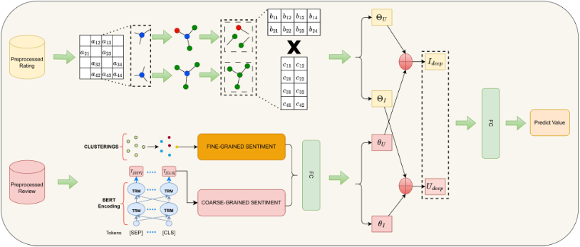

# PreBERT

## Sumary
In summary, the contributions of this work are threefold: 
- (1) We propose comprehensive data pre-processing methods, which involve detecting and reassessing inconsistent data points, which can significantly improve the performance of any RS model. 
- (2) We study replacing the LDA model with a new topic segmentation approach incorporating BERT, followed by clustering methods. To the best of our knowledge, this is the first work to investigate replacing LDA with another topic extraction method in an RS model. 
- (3) Extensive experiments on Amazon datasets showing up to 27.63% improvement over the best previous baseline in rating prediction performance




## Instructions to Run the Source Code

In this study, we use Stanford CoreNLP. Please make sure the device has the required model installed and that `JAVA_HOME` is set up properly on the device.

After that, install the project's single `requirements.txt` and use the
mode-based experiment launchers. For example, run the main PreBERT result with:

```bash
./scripts/run_prebert.sh main
```

Main results, ablations, LLM evaluation, and semantic-retention commands are
documented in [EXPERIMENTS.md](EXPERIMENTS.md).

Dataset construction, LLM preprocessing, and deterministic 80/10/10 splitting
are unified in `preprocessing_reviews.py`. The configurable multi-dataset
workflow is available in `Preprocessing-Datasets.ipynb`. Experiment runners and
outputs live under `experiments/`, while shared runtime settings live in
`helper/llm_settings.py`.

Splits are stored per random seed at
`data/splits/<dataset>/seed_<seed>/`. Configure `SPLIT_SEEDS` in
`scripts/run_preprocessing.sh` to generate them. By default test metrics use
`overall`; set `TEST_RATING_FIELD="overall_new"` while building splits and
`GROUND_TRUTH_FIELD="overall_new"` in `scripts/run_prebert.sh` to evaluate the
reassessed test ratings.

Set `SPLIT_PROFILE="7-1-2"` in the preprocessing and experiment launchers to
use a 70/10/20 split. It is stored separately at
`data/splits/<dataset>/ratio_7_1_2/seed_<seed>/`; `8-1-1` retains the existing
80/10/10 directory layout.

For 10K Digital Music and Toys & Games subsets, `run_preprocessing.sh` uses
the `digital-music` and `toys-games` sampling profiles. They target the
full-dataset review/user and review/item rates from the experiment table; the
generated `*.sampling_report.json` records the target and observed deviation.
Run `./scripts/run_preprocessing.sh --dry-run` to inspect the commands without
downloading raw archives or replacing datasets.

For the PreBERT-Rec feature ablation, run
`./scripts/run_prebert.sh rec-feature-ablation`. It runs `full`,
`without-review`, and `without-rating`: the latter removes the SVD rating
vector, FM fusion embedding, and user/item rating biases, while the former
removes the review feature vector. The learned global intercept remains in
every variant.

Set `K_TOPIC` in either PreBERT launcher to choose the number of topic
clusters; the value is included in checkpoints and result paths.
